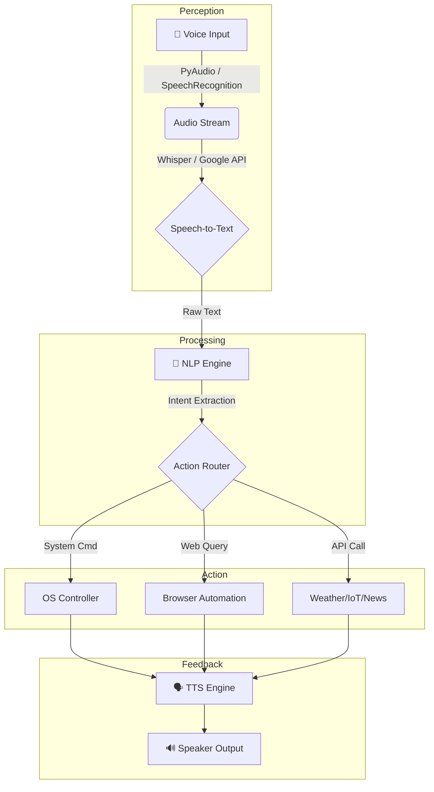

# 🤖 VYOM – Virtual Yet Omnipotent Machine

<div align="center">


[](https://python.org)
[](LICENSE)
[](CONTRIBUTING.md)
[](https://socialwinterofcode.com/)

**🚀 A Futuristic AI-Powered Personal Assistant Inspired by J.A.R.V.I.S.**

</div>

---

## 🏗️ Technical Architecture

VYOM is built on a **Modular Multi-Threaded Architecture**. Unlike linear assistants, VYOM decouples peripheral I/O (Voice/Listen) from core logic (NLP/Action) to prevent UI freezing and ensure real-time responsiveness.

### System Flow & Data Lifecycle
The following diagram illustrates how a voice command propagates through the modular layers:



### 🧠 Multi-Threading Logic
To maintain the "Always Listening" capability while executing heavy AI tasks, VYOM utilizes Python's `threading` and `asyncio` modules:
* **Thread 1 (Listener):** Continuously monitors the microphone for the wake word.
* **Thread 2 (Processor):** Handles API calls to Groq/Cohere without blocking the listener.
* **Thread 3 (Executor):** Manages OS-level tasks and GUI updates.

---

## 🛠️ Technologies Used

<div align="center">

| Category | Technologies |
|----------|-------------|
| **🐍 Core Language** |  |
| **🤖 AI Models** |   |
| **⚡ Performance** |   |
| **🧠 NLP** |  |

</div>

---

## ⚡ Quick Start

Get VYOM running in under 5 minutes!

```bash
# One-liner installation (Windows)
git clone https://github.com/th-shivam/vyom.git && cd vyom && python -m venv .venv && .venv\Scripts\activate && pip install -r requirements.txt

# One-liner installation (Mac/Linux)
git clone https://github.com/th-shivam/vyom.git && cd vyom && python3 -m venv .venv && source .venv/bin/activate && pip install -r requirements.txt
```

Then add your API keys and run:
```bash
python main.py
## 📂 Project Structure
For SWOC contributors, please refer to this modular map before submitting PRs:
```plaintext

│
├── Backend/                           # Core backend logic for the assistant
│   │
│   ├── Automation.py                  # Handles task automation (system tasks, workflows)
│   ├── ChatBot.py                     # Manages chatbot logic and conversational flow
│   ├── ImageGeneration.py             # Generates images using AI models/APIs
│   ├── Model.py                       # Loads and manages AI/ML models
│   ├── Productivity.py                # Productivity features (notes, reminders, utilities)
│   ├── RealTimeSearchEngine.py        # Performs real-time web/search queries
│   ├── SpeechToText.py                # Converts spoken audio input into text
│   └── TextToSpeech.py                # Converts text responses into spoken audio
│
├── Frontend/                          # User interface and client-side logic
│   │
│   ├── Files/                         # Runtime data and application state storage
│   │   │
│   │   ├── Database.data              # Stores persistent application data
│   │   ├── ImageGeneration.data       # Stores image generation history/results
│   │   ├── Mic.data                   # Stores microphone state and audio metadata
│   │   ├── Responses.data             # Stores chatbot responses
│   │   └── Status.data                # Tracks application and system status
│   │
│   ├── Graphics/                      # UI assets and visual resources
│   │   │
│   │   ├── Chats.png                  # Chat interface icon/image
│   │   ├── Close.png                  # Close window button icon
│   │   ├── GUI.py                     # GUI layout logic using graphical assets
│   │   ├── Home.png                   # Home screen icon/image
│   │   ├── Mic_off.png                # Microphone disabled icon
│   │   ├── Mic_on.png                 # Microphone enabled icon
│   │   ├── Minimize.png               # Minimize window icon
│   │   ├── maximize.png               # Maximize window icon
│   │   ├── minimize2.png              # Alternate minimize icon
│   │   ├── settings.png               # Settings icon
│   │   ├── VYOM.jpeg                  # Project logo / branding image
│   │   └── jarvis.gif                 # Animated assistant graphic
│   │
│   ├── automation/                    # Frontend automation tests
│   │   └── test_gui.py                # Automated tests for GUI behavior
│   │
│   ├── playwright_tests/              # Playwright-based UI testing
│   │   ├── homepage.png               # Screenshot of homepage during tests
│   │   ├── index.html                 # Static test page for UI validation
│   │   └── test_gui.py                # Playwright test cases for GUI
│   │
│   ├── tests/                         # Frontend test specifications
│   │   └── test_issue4.spec.js        # Test case for reported issue #4
│   │
│   ├── GUI.py                         # Main frontend GUI controller
│   └── test_gui.py                    # Manual/functional GUI test script
│
├── config/                            # Configuration and environment settings
│   │
│   ├── __init__.py                    # Marks config as a Python package
│   └── settings.py                   # Centralized configuration variables
│
├── utils/                             # Shared utility functions
│   │
│   ├── logger.py                     # Logging utilities for debugging and monitoring
│   └── memory.py                     # Memory management and context handling
│
├── .env.example                       # Sample environment variables file
├── .gitignore                         # Files and folders ignored by Git
├── CODE_OF_CONDUCT.md                 # Community guidelines and behavior rules
├── CONTRIBUTING.md                    # Contribution guidelines for developers
├── LICENSE                            # Project licensing information
├── README.md                          # Project overview and documentation
│
├── main.py                            # Application entry point
├── requirements.txt                  # Python dependencies list
│
├── test_logger.py                    # Unit tests for logger utility
└── test_memory.py                    # Unit tests for memory utility
```

---

## 🛠️ Installation & Setup

### Prerequisites
* **Python 3.13+**
* **FFmpeg** (Required for audio processing)
* **C++ Build Tools** (Required for PyAudio on Windows)

**🐧 Linux/Mac Setup (Audio Dependencies)**
Most setup errors occur due to missing audio driver headers. Run the following before `pip install`:

* **For Ubuntu/Debian:**
```
sudo apt-get update
sudo apt-get install python3-pyaudio portaudio19-dev libasound2-dev espeak
```

* **For macOS:**
```
brew install portaudio
pip install pyaudio
```

### 📦 Standard Installation
**1. Clone & Environment**
```
git clone [https://github.com/th-shivam/vyom.git](https://github.com/th-shivam/vyom.git) && cd vyom
python -m venv .venv
source .venv/bin/activate  # Mac/Linux
# .venv\Scripts\activate   # Windows
```
**2. Install & Run**
```
pip install -r requirements.txt
python main.py
```

---

## 🌍 Community & Contributors

### 💖 Contributors  
Thanks to these amazing people who have contributed to **VYOM** ✨  

<div align="center">
  <a href="https://github.com/Th-Shivam/VYOM/graphs/contributors">
    
  </a>
</div>

<br/>

### ⭐ Project Support

<div align="center">

[](https://github.com/Th-Shivam/VYOM/stargazers)
&nbsp;&nbsp;
[](https://github.com/Th-Shivam/VYOM/network/members)

</div>

---

## 🤝 Contributing

We are proud to be an official part of **Social Winter of Code (SWOC) 2026**! 🚀 

We welcome contributors of all skill levels. To ensure a smooth collaboration, please identify your path:

* **🌱 Beginners**: Look for issues labeled `good-first-issue` and `documentation`. Perfect for your first PR!
* **🛠️ Advanced**: Check for `modular-enhancement` and `threading-optimization` to work on the core engine.

### 🛣️ Quick Workflow
1. **Fork** the repository and create your branch.
2. Follow the **PEP 8** style guide for Python code.
3. Ensure your module is placed in the correct directory (see [Project Structure](#-project-structure)).
4. Open a PR with a clear description of your changes.

**[📋 Full Contributing Guide](CONTRIBUTING.md)** | **[🏗️ Architecture Deep Dive](docs/ARCHITECTURE.md)**

---

## 📄 License

This project is licensed under the **MIT License**. You are free to use, modify, and distribute this software, provided the original copyright and license notice are included.

> **TL;DR:** Open-source, permissive, and community-friendly.

See the [LICENSE](LICENSE) file for the full legal text.

---

<div align="center">

**If you find VYOM helpful, don't forget to give it a ⭐!**

<sub><strong>VYOM v2.0</strong> • Built with 🐍 Python • Focused on 🏗️ Modular Architecture</sub>

[⬆ Back to Top](#-vyom--virtual-yet-omnipotent-machine)

</div>
