# 🤖 VYOM – Virtual Yet Omnipotent Machine

<div align="center">


[](https://python.org)
[](LICENSE)
[](CONTRIBUTING.md)
[](https://socialwinterofcode.com/)

**🚀 A Futuristic AI-Powered Personal Assistant Inspired by J.A.R.V.I.S.**

</div>

---

## 🏗️ Technical Architecture

VYOM is built on a **Modular Multi-Threaded Architecture**. Unlike linear assistants, VYOM decouples peripheral I/O (Voice/Listen) from core logic (NLP/Action) to prevent UI freezing and ensure real-time responsiveness.

### System Flow & Data Lifecycle
The following diagram illustrates how a voice command propagates through the modular layers:

```mermaid
graph TD
    subgraph Input_Layer [Perception]
        A[🎤 Voice Input] -->|PyAudio / SpeechRecognition| B(Audio Stream)
        B -->|Whisper / Google API| C{Speech-to-Text}
    end

    subgraph Brain_Layer [Processing]
        C -->|Raw Text| D[🧠 NLP Engine]
        D -->|Intent Extraction| E{Action Router}
    end

    subgraph Execution_Layer [Action]
        E -->|System Cmd| F[OS Controller]
        E -->|Web Query| G[Browser Automation]
        E -->|API Call| H[Weather/IoT/News]
    end

    subgraph Output_Layer [Feedback]
        F & G & H --> I[🗣️ TTS Engine]
        I --> J[🔊 Speaker Output]
    end
```



### 🧠 Multi-Threading Logic
To maintain the "Always Listening" capability while executing heavy AI tasks, VYOM utilizes Python's `threading` and `asyncio` modules:
* **Thread 1 (Listener):** Continuously monitors the microphone for the wake word.
* **Thread 2 (Processor):** Handles API calls to Groq/Cohere without blocking the listener.
* **Thread 3 (Executor):** Manages OS-level tasks and GUI updates.

---

## 📂 Project Structure
For SWOC contributors, please refer to this modular map before submitting PRs:
```plaintext
VYOM/
├── core/
│   ├── engine.py      # Main loop & multi-threading orchestration
│   ├── listener.py    # Voice capture & STT logic
│   └── speaker.py     # TTS implementation
├── modules/           # Modular skills (Add new features here)
│   ├── system_ops.py  # File handling & OS controls
│   └── web_search.py  # Playwright/Selenium automation
├── docs/              # Detailed technical documentation
├── data/              # Model weights, logs, and user configurations
└── main.py            # Entry point for the application
```

---

## 🛠️ Installation & Setup

### Prerequisites
* **Python 3.13+**
* **FFmpeg** (Required for audio processing)
* **C++ Build Tools** (Required for PyAudio on Windows)

**🐧 Linux/Mac Setup (Audio Dependencies)**
Most setup errors occur due to missing audio driver headers. Run the following before `pip install`:

* **For Ubuntu/Debian:**
```
sudo apt-get update
sudo apt-get install python3-pyaudio portaudio19-dev libasound2-dev espeak
```

* **For macOS:**
```
brew install portaudio
pip install pyaudio
```

### 📦 Standard Installation
**1. Clone & Environment**
```
git clone [https://github.com/th-shivam/vyom.git](https://github.com/th-shivam/vyom.git) && cd vyom
python -m venv .venv
source .venv/bin/activate  # Mac/Linux
# .venv\Scripts\activate   # Windows
```
**2. Install & Run**
```
pip install -r requirements.txt
python main.py
```

---

## 🤝 Contributing

We are proud to be an official part of **Social Winter of Code (SWOC) 2026**! 🚀 

We welcome contributors of all skill levels. To ensure a smooth collaboration, please identify your path:

* **🌱 Beginners**: Look for issues labeled `good-first-issue` and `documentation`. Perfect for your first PR!
* **🛠️ Advanced**: Check for `modular-enhancement` and `threading-optimization` to work on the core engine.

### 🛣️ Quick Workflow
1. **Fork** the repository and create your branch.
2. Follow the **PEP 8** style guide for Python code.
3. Ensure your module is placed in the correct directory (see [Project Structure](#-project-structure)).
4. Open a PR with a clear description of your changes.

**[📋 Full Contributing Guide](CONTRIBUTING.md)** | **[🏗️ Architecture Deep Dive](docs/ARCHITECTURE.md)**

---

## 📄 License

This project is licensed under the **MIT License**. You are free to use, modify, and distribute this software, provided the original copyright and license notice are included.

> **TL;DR:** Open-source, permissive, and community-friendly.

See the [LICENSE](LICENSE) file for the full legal text.

---

<div align="center">

**If you find VYOM helpful, don't forget to give it a ⭐!**

<sub><strong>VYOM v2.0</strong> • Built with 🐍 Python • Focused on 🏗️ Modular Architecture</sub>

[⬆ Back to Top](#-vyom--virtual-yet-omnipotent-machine)

</div>
